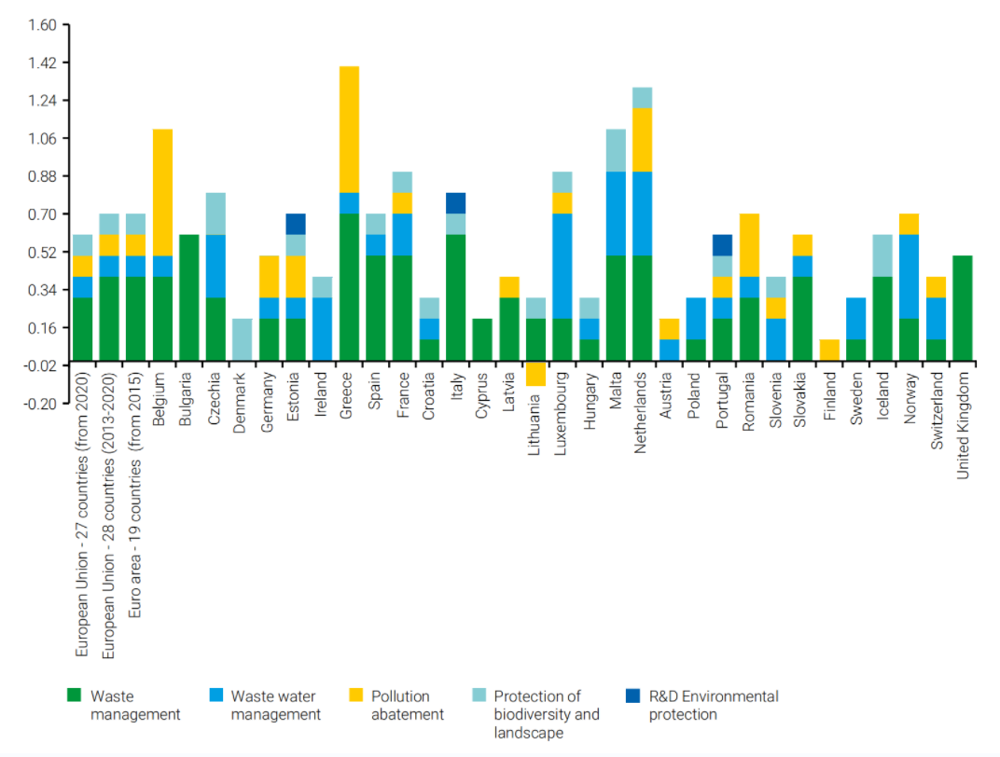
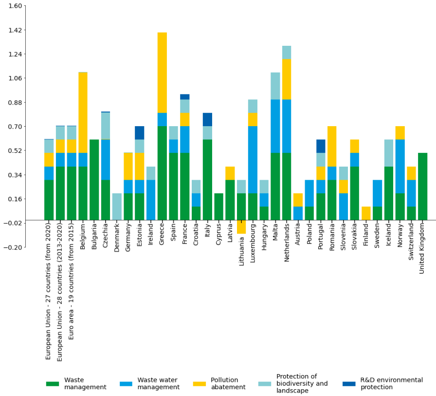
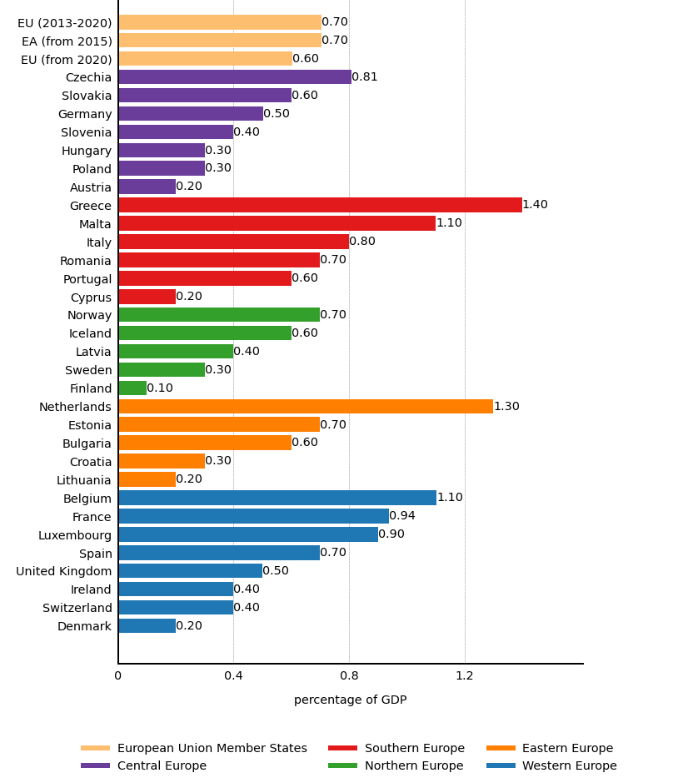

### Lanzhou University
### INFO 250: Information Visualization, Fall 2023
---

## Project 2

## Project Title: Improved Visualization of EU Government Expenditure on Environmental Protection: A Regional Perspective

## Team ID: T10

## Students:
- Hanshuo Qiu, 320210941961
- Chenhao Zhao, 320210941941
- Jintao Jia, 320210941911
- Haoyu Zhao, 320210941931
#### Date: Dec 19, 2023
---
## Abstract

In our environmental protection study, we identified challenges in effectively representing data in the graph **titled "Total general government expenditure on environmental protection in the European Union, 2018"**. We first **reproduced the diagram** and made a series of **modifications**, such as: we primarily **segmented data by regions**, altered presentation patterns, and streamlined visualization by **focusing on key expenditure trends**. The core objective of improving the visualization was to reduce the difficulty of understanding the chart, so that people with different levels of environmental protection knowledge can understand the investment of European governments in environmental protection through the visual content.

## 1. Introduction
**In our exploration of an environmental protection article**, we lauded the significant efforts and investments in the European region. However, our attention was drawn to the accompanying graph, revealing several issues that impeded its effectiveness. The **disorderly arrangement** of countries and the **non-horizontal presentation of names** hindered specific country identification, while the breakdown of spending into five components **added complexity** without aiding understanding. **The lack of ranking and inclusion of negative values** further obscured the overall picture.

&ensp;&ensp;&ensp;&ensp;Recognizing the pivotal role of information visualizations in **facilitating quick and intuitive understanding**, we identified the importance of addressing the graph's shortcomings. Effective visualizations are essential for **conveying complex data efficiently**, **fostering comprehension**, and **aiding decision-making**. In response, we undertook revisions, **including segmentation based on region and improved presentation models**. We also **simplified the display** by focusing solely on total spending, accompanied by direct numerical annotations. These adjustments aimed to correct flaws, ensuring the graph effectively conveys information and aligns with the principles of clarity and simplicity.

## 2. Setting of the Story
For our Information Visualization project, we have chosen to analyze a graph **from "A Global Summary of Policies and Programmes to Reduce Air Pollution"** which illustrates the total general government expenditure on environmental protection as a percentage of Gross Domestic Product (GDP) in various European countries. Figure 1 provides a critical perspective on financial commitments towards comprehensive air quality management. It is worth mentioning that the following is **the original image**.

    
    
Figure 1. Original plot

### 2.1 Overview of the Graph
It **categorizes government expenditures into areas** such as waste management and enforcement capacity. By representing these expenditures as **a percentage of each country's GDP**, the graph offers insights into the relative scale of investment in environmental protection across different nations.

### 2.2 Rationale for Selection
Our selection of this graph was motivated by its relevance to environmental policy financing and its potential for enhancements. We observed that while the graph effectively displays governmental expenditure on environmental protection, it could benefit from improved clarity and interpret-ability. Specifically, **modifications in the color scheme and data presentation** could enhance readability and help a more intuitive comparison across countries. Additionally, **adjusting the scale and layout** would offer a clearer perspective on each country's investment relative to its economic capacity. These refinements align with our course's focus on precision and efficiency in information visualization. 

### 2.3 Interpreting the Graph
The graph should be read with an understanding of the varying economic capacities of different countries. Each bar represents a country. Additionally, **the segments** within these bars indicate **the proportion of GDP** allocated to different environmental protection activities. **The length** of each segment and the cumulative length of all segments in a bar reflect **the intensity of a country's investment** in environmental protection relative to its economic size. Here are our estimates of the specific data in the diagram:

<!DOCTYPE html>
<html>
<head>
    
</head>
</body>
</html>

| Country | Waste Mgmt. | Water Mgmt. | Pollution | Biodiversity | R&D Env. |
|---------|-------------|-------------|-----------|--------------|----------|
| EU (from 2020)      | 0.3 | 0.1 | 0.1 | 0.1 | 0.004 |
| EU (2013-2020)      | 0.4 | 0.1 | 0.1 | 0.1 | 0.004 |
| EA (from 2015)      | 0.4 | 0.1 | 0.1 | 0.1 | 0.004 |
| Belgium            | 0.4 | 0.1 | 0.6 | 0.004| 0.0   |
| Bulgaria           | 0.6 | 0.0 | 0.0 | 0.0  | 0.0   |
| Czechia            | 0.3 | 0.3 | 0.004| 0.2 | 0.004 |
| Denmark            | 0.0 | 0.0 | 0.0 | 0.2  | 0.0   |
| Germany | 0.2 | 0.1 | 0.2 | 0.004 | 0.0 |
| Estonia | 0.2 | 0.1 | 0.2 | 0.1 | 0.1 |
| Ireland | 0.0 | 0.3 | 0.0 | 0.1 | 0.0 |
| Greece | 0.7 | 0.1 | 0.6 | 0.0 | 0.0 |
| Spain | 0.5 | 0.1 | 0.0 | 0.1 | 0.0 |
| France | 0.5 | 0.2 | 0.1 | 0.1 | 0.04 |
| Croatia | 0.1 | 0.1 | 0.0 | 0.1 | 0.0 |
| Italy | 0.6 | 0.0 | 0.0 | 0.1 | 0.1 |
| Cyprus | 0.2 | 0.0 | 0.0 | 0.0 | 0.0 |
| Latvia | 0.3 | 0.0 | 0.1 | 0.0 | 0.0 |
| Lithuania | 0.2 | 0.0 | -0.1 | 0.1 | 0.0 |
| Luxembourg | 0.2 | 0.5 | 0.1 | 0.1 | 0.0 |
| Hungary | 0.1 | 0.1 | 0.0 | 0.1 | 0.0 |
| Malta | 0.5 | 0.4 | 0.0 | 0.2 | 0.0 |
| Netherlands | 0.5 | 0.4 | 0.3 | 0.1 | 0.0 |
| Austria | 0.0 | 0.1 | 0.1 | 0.0 | 0.0 |
| Poland | 0.1 | 0.2 | 0.0 | 0.0 | 0.0 |
| Portugal | 0.2 | 0.1 | 0.1 | 0.1 | 0.1 |
| Romania | 0.3 | 0.1 | 0.3 | 0.0 | 0.0 |
| Slovenia | 0.0 | 0.2 | 0.1 | 0.1 | 0.0 |
| Slovakia | 0.4 | 0.1 | 0.1 | 0.0 | 0.0 |
| Finland | 0.0 | 0.0 | 0.1 | 0.0 | 0.0 |
| Sweden | 0.1 | 0.2 | 0.0 | 0.0 | 0.0 |
| Iceland | 0.4 | 0.0 | 0.0 | 0.2 | 0.0 |
| Norway | 0.2 | 0.4 | 0.1 | 0.0 | 0.0 |
| Switzerland | 0.1 | 0.2 | 0.1 | 0.0 | 0.0 |
| United Kingdom | 0.5 | 0.0 | 0.0 | 0.0 | 0.0 |

    
Table 1. Estimated data

### 2.4 analysis of the Graph
Visual pattern:
- Size of the bar
- position of the bar
- color for the category

Data variables in visual mode:
- Category variable: Country name, arranged horizontally along the X-axis.
- Numerical variable: Total government spending on environmental protection, expressed as a percentage of GDP, arranged vertically along the Y-axis.
- Subcategory variables: Represented by bars of different colors, each color represents an area of environmental spending, such as waste management, wastewater management, pollution abatement, biodiversity and landscape conservation, and environmental research and development.

Chart types show the relationship between data points:
- This chart shows the proportion of countries' spending on various areas of environmental protection.
- By comparing the height of bars of the same color, it can be seen that different countries have different investments in specific areas of environmental protection.
- The bar chart groups for each country also show the allocation of government spending between different areas of environmental protection.

Data type:
- Categorical
- Numerical

### 2.5 Personal and Academic Relevance
Our team shares a deep commitment to exploring the dynamics of environmental policy and air quality management. This graph not only serves as a tool for academic analysis but also resonates with our personal dedication to environmental sustainability. It exemplifies the complex interplay between economic development and environmental stewardship, a theme that is central to our studies and our vision for a sustainable future. We **reproduced the original drawing as requested**:

    
    
Figure 2. Replicated plot

## 3. Events

### 3.1 Horizontal Bar Chart Conversion

Changed the original vertical bar chart to a horizontal bar so the Y-axis represents the country and the X-axis the percentage of GDP. This adjustment was made because in the original visualization, a horizontal bar chart proved easier to read than a vertical one, particularly as the country names are longer and more numerous. This change **reduces the overlap or vertical labels** caused by space constraints, making each country's name clearly visible. Horizontal bar charts are preferable **when displaying large or long category labels**. The change from vertical to horizontal bars utilizes our natural reading flow from left to right and aids in easier tracking across longer text labels, which aligns with the cognitive principle of **pattern recognition** and **spatial orientation**.

### 3.2 Geographic Categorization and Custom Legends

Categorized countries by geographic area and manually created legends with specific colors for each region. This approach provides an additional dimension of data that aids viewers in understanding comparisons between regions and ensures the clarity and accuracy of the legend. Grouping the data makes it **more orderly and easier to track trends in specific regions**. Custom legends bring the legend closer to the actual displayed data, thereby **reducing interpretation difficulty**. **When data can be naturally grouped** according to certain attributes, such as geographical location or type, a grouping arrangement is beneficial. Grouping countries by geographic area aligns with the principle of **chunking**, where similar items are grouped together to reduce cognitive load and make the information easier to process and remember.

### 3.3 Color Simplification

Reduced the number of colors used, opting for a single color for each region. The goal is to simplify the visual elements and reduce visual distractions, thereby **highlighting the overall trend**. This approach makes it easier for viewers to focus on the data itself, rather than the colors. **When the data categories presented are numerous and complex, necessitating simplification for improved clarity**, simplified colors are utilized. Using fewer colors reduces the cognitive load and visual distractions, which is in line with the principle of **simplification**. It allows the audience to focus on the data trends rather than being overwhelmed by multiple colors.

### 3.4 External Placement of Legend

Placed the legend outside the chart. The goal is to free up more space for the data chart itself. This approach makes the chart area more **focused on data presentation and reduces internal clutter**. **When inline diagrams consume too much chart space or interfere with data presentation**, external legends are necessary. An external legend aligns with the **modularity principle**, which suggests that separating complex information into distinct chunks makes the data more digestible.

### 3.5 Chart Resizing

Resized the chart to make it larger. This adjustment accommodates more data points and labels, avoiding crowding. Each data point and label **has enough space to display**, reducing congestion and increasing readability. Larger visualizations are preferable when dealing with a large number of data points, especially **when they require additional space for clear presentation**. Making the chart larger can cater to the **perceptual bandwidth** of the viewer, allowing them to take in more data at once without overwhelming them, provided the data is well-organized.

### 3.6 Separate Representation of Country Totals

Did away with stacked bar charts, instead representing the totals for each country separately. While stacked bar charts can show contributions of individual parts, they can sometimes obscure overall trends. Showing each country's totals separately allows for **a clearer comparison of total** spending across different countries, simplifying data interpretation. Stacked bar charts may be avoided **when the focus is on comparing total values across populations, or when they complicate data interpretation**. Representing totals separately instead of using stacked bars adheres to the principle of **directness**, where the visualization directly reflects the data in a manner that is immediately apparent to the viewer.

### 3.7 Addition of Reference Lines

Added a dashed gray line to the chart as a reference line. This is because reference lines assist viewers in quickly and accurately comparing and evaluating data values. Dotted lines provide a visual reference, aiding in tracking and aligning data points within the chart, thus **facilitating reading**. **When it is necessary to evaluate values swiftly or compare different data points**, especially with a large span of data values, appropriate reference lines are advantageous. Reference lines help in making quick and accurate comparisons, which is a practical application of **alignment** principles, aiding in the reduction of search time and enhancement of comparison efficiency. 

### 3.8 Data Sorting

In our second chart, the countries in each region are no longer listed in unordered order, but are ranked from largest to smallest in terms of value. This ordering allows viewers to quickly identify the leaders and laggards within each region. **Ordered data is easier to compare and analyze**, particularly **when looking for trends and patterns**. Sorting is useful when highlighting rankings or comparisons within each category, such as in data presentations on performance, income, population, and so forth. Sorting data aligns with the cognitive principle of **serial-position effect**, which suggests that items at the beginning and end of a list are more easily recalled, making it easier to spot trends and outliers.

### 3.9 Labeling

Placed numerical labels at the end of each bar on the chart to display specific data values. Providing exact data values allows the audience to discern not only the relative size but also the precise value. **Enhancing readability** involves reducing the need for viewers to alternate between charts and annotations during interpretation. This approach is suitable **for most situations**, especially when precise values are crucial for understanding the data. Placing numerical labels at the end of each bar supports the **recognition over recall** principle, as it allows viewers to see the data directly rather than having to remember and match data points with a separate legend or axis.

### 3.10 Overall Design Considerations

Considering all the above changes, the improved chart design **focuses on enhancing the readability of the data and the intuitiveness of comparisons**. By simplifying complex stacked bar charts to a representation of a single data point, using a horizontal layout, and sorting by value size, the chart facilitates quicker comprehension of key information and overall trends for viewers. When designing a chart, it is essential to adjust these elements according to the specific data characteristics and presentation objectives. For instance, a stacked bar chart might be preferred for comparing the proportions of various categories, while simplified non-stacked charts, ordered arrangements, and clear visual aids such as guides are more apt for highlighting overall trends and rankings. In summary, **the key to data visualization lies in conveying information clearly and accurately, ensuring charts are easy to understand and interpret**. Every design decision should revolve around these **core principles**.The figure shows our final changes:

    
    
Figure 3. Improved plot

## 4. End of the Story

### 4.1 Original Graph
The original graph displayed government expenditure on environmental protection across EU countries using a clustered bar chart. It excelled in providing extensive data, covering multiple countries and various categories of expenditure. However, its **major drawbacks** included complexity in layout and information overload, making it challenging to compare data between countries. The inconsistent use of colors and the arrangement of country names added to the visual chaos, hindering quick comprehension of key information, particularly in horizontal comparisons across different spending categories.

### 4.2 Revised Graph
The revised graph adopts a horizontal bar chart layout, grouping countries by region and amalgamating various expenditures into a single bar. This design markedly enhances data readability by reducing visual clutter, presenting information in a more lucid manner. The systematic arrangement of countries within their respective regions, along with a unified color scheme, simplifies comparisons both within and across groups. Moreover, the revised graph, by minimizing unnecessary color usage and eliminating superfluous details, improves the efficiency and accuracy of information conveyance. **Overall, the upgraded graph shows significant improvements in visual appeal and data communication, aligning more closely with the data's characteristics and the audience's comprehension**.

## 5. Conclusion

In our information visualization project, we enhanced the original chart depicting the environmental protection expenditure of the European Union. The original chart, presented as a vertical bar graph, was challenging to read due to the multitude of countries and their lengthy names. To address this, we transformed it into a horizontal bar chart, categorizing countries by geographical regions and assigning specific colors to each, thereby clarifying the chart and facilitating easier understanding and comparison of data across different regions. We also simplified the use of colors, removed the stacked bars to display each country's total expenditure separately, enlarged the size of the chart, and added gray dashed lines as reference points. These modifications were aimed at improving the chart's readability and intuitiveness. These adjustments reflect our commitment to effective communication and precise data presentation, ensuring the design not only accurately represents the data but also is easy to understand and interpret.
